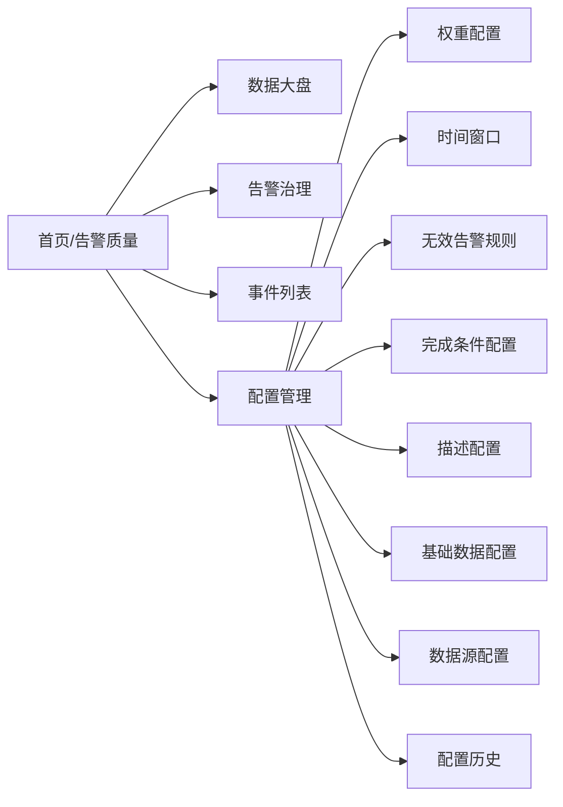

# 告警质量平台 PRD（反向梳理版）

- 文档版本：v1.0
- 编写日期：2026-03-23
- 文档类型：基于现有系统能力的反向产品需求文档
- 适用范围：告警质量平台（数据大盘、告警治理、事件列表、配置管理）

---

## 1. 产品概述

### 1.1 产品背景
告警平台在长期使用中常见三类问题：
1. 告警量大但有效信息少，处理效率低。
2. 告警规则质量不可量化，治理动作难以追踪。
3. 数据口径不一致，运营、治理、复盘使用不同结果。

本产品面向上述问题，提供“可量化、可配置、可追溯”的告警质量管理能力。

### 1.2 产品定位
本产品定位为“告警质量运营与治理平台”，聚焦三件事：
1. 看清现状：通过数据大盘和趋势图呈现告警质量状态。
2. 推动治理：通过规则质量得分、画像、认领、待办形成闭环。
3. 固化标准：通过配置中心统一评分口径、规则标准和数据来源。

### 1.3 产品目标
1. 建立统一告警质量评价口径（8个质量维度 + 综合分）。
2. 支持手动/自动同步外部告警数据并可追踪进度与历史。
3. 支持规则级治理流程，提升规则质量与处理效率。
4. 支持配置审计与回滚，保障治理策略可控。

### 1.4 产品范围
本期范围包含：
1. 数据大盘（筛选、指标、趋势、分布、高频统计）。
2. 告警治理（规则列表、画像、认领、待办、完成条件）。
3. 事件列表（调试验证口径的事件明细查询）。
4. 配置管理（权重阈值、时间窗口、无效规则、描述、基础维度、数据源、同步任务、历史）。

不在本期范围：
1. 外部工单系统联动。
2. AI 自动生成治理建议。
3. 多租户权限体系。

### 1.5 成功指标（产品层）
1. 日活治理用户数（DAU）持续增长。
2. 已认领规则占比、已完成规则占比提升。
3. 质量综合分稳定提升，低分规则数量下降。
4. 同步任务成功率达到稳定阈值（建议 > 99%）。

---

## 2. 用户画像

| 角色 | 主要职责 | 核心诉求 | 典型使用场景 |
|---|---|---|---|
| 值班工程师 | 日常响应告警、处理故障 | 快速识别高优先级告警，减少噪声 | 查看S1/S2、未关闭事件、MTTA/MTTR与明细 |
| SRE/稳定性负责人 | 规则治理、流程优化 | 有统一评分标准和整改闭环 | 查看规则质量得分、认领规则、跟踪待办 |
| 业务技术负责人 | 关注域/系统稳定性 | 看到本域质量趋势和问题集中点 | 按业务域/系统查看趋势与分布 |
| 平台管理员 | 维护平台配置与同步 | 配置可控、可回滚、可审计 | 维护阈值/规则/数据源、查看同步历史 |

### 2.1 用户痛点
1. 告警“数量多但不聚焦”，难以判断优先级。
2. 告警质量标准分散，团队间口径不统一。
3. 导入数据不透明，失败排查成本高。
4. 配置改动影响范围不明确，回退困难。

### 2.2 关键体验目标
1. 用户 1 分钟内可定位“当前最大风险点”。
2. 用户 3 分钟内可完成“筛选 -> 定位 -> 下钻明细”。
3. 管理员 5 分钟内可完成“配置修改 -> 生效验证 -> 历史追溯”。

---

## 3. 核心功能模块

| 功能模块 | 模块说明 | 对用户的直接价值 |
|---|---|---|
| 告警质量总览大盘 | 用统一口径展示事件量、严重度、效率与质量分 | 快速看清全局状态和风险变化 |
| 统一筛选与周期对比 | 提供业务维度与时间范围筛选，并支持上一周期对比 | 让分析结论更精准、更可解释 |
| 告警事件列表 | 提供完整事件明细，用于核验与排查 | 从指标下钻到事件，验证真实性 |
| 规则质量治理 | 以规则为治理对象展示得分、达标状态与操作入口 | 从“被动响应”转向“主动治理” |
| 规则画像与待办闭环 | 单规则画像、认领、完成条件校验、待办跟踪 | 明确责任与动作，提升治理落地率 |
| 评分策略与基础配置 | 权重阈值、无效规则、时间窗口、描述、基础维度配置 | 统一口径并支持业务化调整 |
| 数据源与同步管理 | 数据源参数维护、手动同步、自动同步任务、进度和历史 | 保证数据新鲜、同步可控且可追溯 |
| 配置审计与回滚 | 记录配置变更并支持回滚 | 降低误操作风险，提高变更安全性 |

---

## 4. 功能详细说明（含交互流程、表结构、接口）

### 4.1 数据大盘

#### 4.1.1 功能范围
1. 指标卡：总事件数、S1/S2/S3、未关闭、告警重复率、MTTA、MTTR。
2. 质量卡：综合评分 + 8个质量维度指标。
3. 图表：趋势、维度分布、评分统计。
4. 高频告警统计：按规则聚合事件数。

#### 4.1.2 核心交互流程
1. 用户选择业务域/子域/系统/时间范围。
2. 用户点击“应用筛选”。
3. 系统并行拉取事件、质量覆盖率、扩展指标、高频统计。
4. 系统刷新指标卡、图表、统计表。
5. 用户点击某指标趋势入口，打开趋势与明细弹窗下钻。

#### 4.1.3 关键接口
| 接口 | 用途 | 关键入参 | 关键出参 |
|---|---|---|---|
| `GET /api/incidents` | 获取筛选后的事件列表 | `domain/sub_domain/system/start_date/end_date` | `data,total` |
| `GET /api/incidents/new-metrics` | 获取夜间/变更期/无效/升级/抖动指标 | 同上 | `night_count/change_count/invalid_rate/escalation_rate/jitter_rate` |
| `GET /api/incidents/rule-coverage` | 获取手册覆盖率、场景关联率 | 同上 | `runbook_coverage/scene_coverage/rule_count` |
| `GET /api/alert-rules/quality-score/aggregate` | 获取综合分及上一周期变化 | 同上 | `average_score/score_change/rule_count` |
| `GET /api/alert-rules/quality-score/trend` | 获取综合分趋势 | `period + 筛选` | `dates/scores` |
| `GET /api/alert-rules/quality-score/by-dimension` | 获取综合分维度分布 | `dimension + 筛选` | `items` |
| `GET /api/metrics/<metric>/trend` | 获取维度指标趋势 | `metric/period + 筛选` | `dates/values` |
| `GET /api/metrics/<metric>/by-dimension` | 获取维度指标分布 | `metric/dimension + 筛选` | `items` |
| `GET /api/incidents/top-alerts` | 获取高频告警统计 | 筛选参数 | `top_alerts` |

---

### 4.2 告警治理

#### 4.2.1 功能范围
1. 告警规则质量得分列表（支持排序、筛选、批量选择）。
2. 单规则“画像”弹窗（显示规则得分构成与事件明细）。
3. 单条刷新得分、批量治理动作。
4. 规则认领与待办跟踪。

#### 4.2.2 核心交互流程
1. 用户进入告警治理页并设置筛选条件。
2. 系统返回规则列表及每条规则的实时质量分。
3. 用户可点击“画像”查看单规则详情并定位短板维度。
4. 用户执行认领/批量操作，形成待办治理任务。
5. 用户完成改进后通过完成条件校验，标记完成。

#### 4.2.3 关键接口
| 接口 | 用途 | 关键入参 | 关键出参 |
|---|---|---|---|
| `GET /api/alert-rules` | 获取规则质量列表 | `domain/sub_domain/system/search/sort_by/sort_order/start_date/end_date` | `rules` |
| `GET /api/alert-rules/<rule_id>/quality-score` | 获取规则画像数据 | `rule_id,start_date,end_date` | `quality_score/raw_data/score_details` |
| `GET /api/alert-rules/quality-score/<rule_id>/refresh` | 刷新单规则质量分 | `rule_id,start_date,end_date` | `quality_score` |
| `POST /api/alert-rules/quality-score/batch` | 批量刷新规则质量分 | `rule_ids,start_date,end_date` | `results` |
| `GET /api/incidents/<rule_id>/incidents` | 查看规则关联事件明细 | `rule_id,start_date,end_date` | `incidents` |
| `GET /api/completion-conditions` | 获取完成条件 | - | `conditions` |

---

### 4.3 事件列表

#### 4.3.1 功能范围
1. 独立菜单的事件列表页面。
2. 筛选：业务域、子域、系统、关键词、时间范围。
3. 列表：展示事件核心字段用于核验和排查。

#### 4.3.2 核心交互流程
1. 用户输入关键词或选择筛选项。
2. 用户点击“应用筛选”。
3. 系统返回匹配事件并展示。
4. 用户通过多字段核对事件质量与导入效果。

#### 4.3.3 关键接口
| 接口 | 用途 | 关键入参 | 关键出参 |
|---|---|---|---|
| `GET /api/incidents` | 获取事件列表 | `domain/sub_domain/system/start_date/end_date,page,per_page` | `data,total,pages` |

---

### 4.4 配置管理

#### 4.4.1 权重配置
- 功能：配置8个质量维度的权重、阈值类型、阈值值、得分方向。
- 约束：权重总和必须为100。
- 用户价值：评分规则透明且可业务化。

关键接口：
| 接口 | 用途 |
|---|---|
| `GET /api/score-thresholds` | 读取当前权重阈值配置 |
| `POST /api/score-thresholds/batch` | 批量保存配置 |
| `POST /api/score-thresholds/init` | 恢复初始化配置 |

#### 4.4.2 时间窗口
- 功能：配置夜间、变更窗口、抖动判定时长等。
- 用户价值：让“夜间数、变更期事件、抖动”可按团队规则定义。

关键接口：
| 接口 | 用途 |
|---|---|
| `GET /api/time-windows` | 获取时间窗口 |
| `POST /api/time-windows` | 新增时间窗口 |
| `PUT /api/time-windows/<id>` | 编辑时间窗口 |
| `POST /api/time-windows/init-defaults` | 初始化默认时间窗口 |

#### 4.4.3 无效告警规则
- 功能：配置字段规则判断“无效告警”。
- 用户价值：让无效告警率计算可解释、可调整。

关键接口：
| 接口 | 用途 |
|---|---|
| `GET /api/invalid-alert-rules` | 获取无效规则 |
| `POST /api/invalid-alert-rules` | 新增无效规则 |
| `PUT /api/invalid-alert-rules/<id>` | 更新无效规则 |
| `POST /api/invalid-alert-rules/init-defaults` | 初始化默认规则 |

#### 4.4.4 完成条件配置
- 功能：定义“可标记完成”的条件（字段检查、得分检查、比率检查）。
- 用户价值：治理完成有统一标准，减少主观判断。

关键接口：
| 接口 | 用途 |
|---|---|
| `GET /api/completion-conditions` | 获取完成条件 |
| `POST /api/completion-conditions` | 新增条件 |
| `PUT /api/completion-conditions/<id>` | 更新条件 |
| `DELETE /api/completion-conditions/<id>` | 删除条件 |

#### 4.4.5 描述配置
- 功能：维护指标名称和说明，支持页面悬停提示。
- 用户价值：降低理解门槛，提升解释一致性。

关键接口：
| 接口 | 用途 |
|---|---|
| `GET /api/metrics/config` | 获取指标描述配置 |
| `PUT /api/metrics/config/<metric_key>` | 更新指标配置 |
| `POST /api/metrics/init-defaults` | 初始化默认指标描述 |

#### 4.4.6 基础数据配置
- 功能：维护域/子域/系统维度名称；可从事件数据自动初始化。
- 用户价值：维度管理集中化，减少手工维护成本。

关键接口：
| 接口 | 用途 |
|---|---|
| `GET /api/dimensions/config` | 获取维度配置 |
| `PUT /api/dimensions/config/<id>` | 编辑维度配置 |
| `POST /api/dimensions/init-from-incidents` | 从事件初始化维度 |

#### 4.4.7 数据源配置与同步管理
- 功能：维护数据源参数、手动同步、自动同步任务、查看同步进度和历史。
- 用户价值：保证数据可持续更新，并可观察同步状态。

关键接口：
| 接口 | 用途 |
|---|---|
| `GET /api/api-config` | 获取数据源配置 |
| `PUT /api/api-config/<id>` | 更新配置项 |
| `POST /api/sync-data/start` | 启动手动同步（异步） |
| `GET /api/sync-progress/current` | 轮询同步进度 |
| `GET /api/sync-history` | 查看同步历史 |
| `GET /api/sync-tasks` | 获取自动同步任务 |
| `POST /api/sync-tasks` | 新增自动同步任务 |
| `PUT /api/sync-tasks/<id>` | 更新自动同步任务 |
| `DELETE /api/sync-tasks/<id>` | 删除自动同步任务 |
| `POST /api/sync-tasks/<id>/run` | 立即执行任务 |

#### 4.4.8 配置历史
- 功能：记录配置变更，查看旧值/新值，支持回滚。
- 用户价值：变更可追溯、可恢复，提升运维安全性。

关键接口：
| 接口 | 用途 |
|---|---|
| `GET /api/config-history` | 获取配置历史 |
| `POST /api/config-history/<id>/rollback` | 回滚到指定版本 |

---

### 4.5 关键交互流程（用户 -> 系统）

#### 4.5.1 手动同步流程
1. 用户在“数据源配置”选择开始/结束日期并点击“手动同步数据”。
2. 系统校验是否已有运行中任务。
3. 系统创建同步记录并进入运行状态。
4. 系统调用外部接口分页拉取数据，实时更新进度。
5. 系统将数据转换后执行原子覆盖导入。
6. 系统更新同步结果并在前端展示完成信息，完成后进度提示自动消失。

#### 4.5.2 规则治理闭环流程
1. 用户在“告警治理”筛选低分规则。
2. 用户打开规则画像定位扣分维度。
3. 用户认领规则并进入待办。
4. 用户按完成条件整改（手册、场景、得分等）。
5. 系统校验条件通过后允许标记完成。

#### 4.5.3 配置变更与回滚流程
1. 管理员修改配置并保存。
2. 系统落库并记录变更历史（旧值/新值/时间/操作者）。
3. 若新配置导致问题，管理员在配置历史中执行回滚。
4. 系统恢复到历史值并返回成功状态。

---

### 4.6 关键数据表结构（产品视图）

#### 4.6.1 告警事件与规则
| 表名 | 说明 | 核心字段 |
|---|---|---|
| `incidents` | 告警事件主表 | `incident_id,title,rule_id,rule_name,severity,system_domain,sub_domain,business_system,progress,created_at,seconds_to_ack,seconds_to_close,escalations,rule_note,scene,raw_data` |
| `alert_rules` | 规则聚合与质量评分表 | `rule_id,rule_name,runbook_url,rule_note,scene,quality_score,event_count_score,runbook_score,scene_score,invalid_rate_score,escalation_rate_score,mtta_rate_score,mttr_rate_score,jitter_rate_score,raw_*` |

#### 4.6.2 评分与配置
| 表名 | 说明 | 核心字段 |
|---|---|---|
| `score_threshold_configs` | 8维度权重和阈值配置 | `dimension_key,weight,threshold_type,threshold_value,score_direction,is_active` |
| `metric_configs` | 指标名称与描述配置 | `metric_key,metric_name,description,is_active` |
| `invalid_alert_rules` | 无效告警判定规则 | `rule_name,field_name,operator,field_value,is_active,sort_order` |
| `time_window_configs` | 时间窗口配置 | `window_name,window_type,start_hour,end_hour,is_active` |
| `completion_conditions` | 待办完成条件配置 | `name,type,field,value,logic,guide,status,sort_order` |
| `dimension_configs` | 业务维度配置 | `dimension_type,dimension_key,dimension_name,parent_key,is_active` |

#### 4.6.3 同步与审计
| 表名 | 说明 | 核心字段 |
|---|---|---|
| `api_configs` | 数据源配置表 | `config_key,config_value,description` |
| `sync_tasks` | 自动同步任务表 | `task_name,frequency_type,run_time,hourly_interval,sync_days,is_active,last_run_at,next_run_at` |
| `sync_history` | 同步执行历史 | `task_id,trigger_type,status,request_start_date,request_end_date,total_items,success_items,failed_items,progress,message,started_at,finished_at` |
| `config_history` | 配置变更历史 | `config_type,config_id,action,old_value,new_value,changed_by,created_at` |

---

### 4.7 API 总览（按业务域分组）

#### A. 事件与大盘指标
- `GET /api/incidents`
- `POST /api/incidents`
- `PUT /api/incidents/<incident_id>`
- `DELETE /api/incidents/<incident_id>`
- `GET /api/incidents/top-alerts`
- `GET /api/incidents/new-metrics`
- `GET /api/incidents/rule-coverage`
- `GET /api/metrics/trend`
- `GET /api/metrics/detail`
- `GET /api/metrics/<metric>/trend`
- `GET /api/metrics/<metric>/by-dimension`

#### B. 规则质量与画像
- `GET /api/alert-rules`
- `GET /api/alert-rules/quality-scores`（兼容）
- `GET /api/alert-rules/<rule_id>/quality-score`
- `GET /api/alert-rules/quality-score/<rule_id>`（兼容）
- `GET /api/alert-rules/quality-score/<rule_id>/refresh`
- `POST /api/alert-rules/quality-score/batch`
- `GET /api/alert-rules/quality-score/aggregate`
- `GET /api/alert-rules/quality-score/trend`
- `GET /api/alert-rules/quality-score/by-dimension`
- `GET /api/incidents/<rule_id>/incidents`
- `GET /api/alert-rules/<rule_id>/incidents`（兼容）

#### C. 配置管理
- 指标配置：`GET /api/metrics/config`，`PUT /api/metrics/config/<metric_key>`，`POST /api/metrics/init-defaults`
- 时间窗口：`GET /api/time-windows`，`POST /api/time-windows`，`PUT /api/time-windows/<id>`，`POST /api/time-windows/init-defaults`
- 无效规则：`GET /api/invalid-alert-rules`，`POST /api/invalid-alert-rules`，`PUT /api/invalid-alert-rules/<id>`，`POST /api/invalid-alert-rules/init-defaults`
- 维度配置：`GET /api/dimensions/config`，`PUT /api/dimensions/config/<id>`，`POST /api/dimensions/init-from-incidents`
- 完成条件：`GET /api/completion-conditions`，`POST /api/completion-conditions`，`PUT /api/completion-conditions/<id>`，`DELETE /api/completion-conditions/<id>`
- 权重阈值：`GET /api/score-thresholds`，`PUT /api/score-thresholds/<id>`，`POST /api/score-thresholds/batch`，`POST /api/score-thresholds/init`
- 配置历史：`GET /api/config-history`，`POST /api/config-history/<id>/rollback`

#### D. 数据源与同步
- 数据源配置：`GET /api/api-config`，`PUT /api/api-config/<id>`
- 自动任务：`GET /api/sync-tasks`，`POST /api/sync-tasks`，`PUT /api/sync-tasks/<id>`，`DELETE /api/sync-tasks/<id>`，`POST /api/sync-tasks/<id>/run`
- 同步执行与追踪：`POST /api/sync-data/start`，`POST /api/sync-data`，`GET /api/sync-progress/current`，`GET /api/sync-history`

---

## 5. 页面结构

### 5.1 页面导航结构

### 5.2 页面级模块清单
| 页面 | 模块 | 关键交互 |
|---|---|---|
| 数据大盘 | 筛选区 | 选择维度/时间并应用 |
| 数据大盘 | 指标卡区 | 查看指标，打开趋势弹窗 |
| 数据大盘 | 图表区 | 切换周期、看趋势与分布 |
| 数据大盘 | 高频统计表 | 翻页查看高频规则 |
| 告警治理 | 筛选区 | 关键词+时间+维度筛选 |
| 告警治理 | 规则质量表 | 排序、画像、认领、刷新 |
| 告警治理 | 待办Tab | 批量完成、编辑改进措施 |
| 事件列表 | 筛选区+事件表 | 查询事件并核验导入结果 |
| 配置管理 | 8个配置Tab | 配置、保存、初始化、回滚、同步 |

### 5.3 页面跳转与弹窗关系
1. 侧边栏负责页面切换（大盘/治理/事件列表/配置管理）。
2. 大盘与治理页面均可进入“指标趋势弹窗”与“规则画像弹窗”。
3. 配置管理内通过 Tab 切换子能力，不离开页面。

---

## 6. 技术说明（指标定义、计算逻辑、配置说明）

### 6.1 数据同步与数据源说明

#### 6.1.1 数据源调用规范
1. 外部数据源接口：告警事件列表接口。
2. `app_key` 固定值，放置在 URL 参数中。
3. 请求体包含：`start_time/end_time/team_ids/channel_ids/limit/p`。
4. `limit` 采用每页100条，循环翻页获取。

#### 6.1.2 导入策略
1. 每次同步采用全量覆盖策略（不做“已存在检查”）。
2. 以最新 API 数据覆盖本地 `incidents` 与 `alert_rules`。
3. 导入过程要求原子性：失败即整体回滚，避免部分更新。

#### 6.1.3 同步执行方式
1. 手动同步：用户指定时间窗口，异步执行，前端轮询进度。
2. 自动同步：支持每日定时或按小时执行，支持配置同步天数。
3. 同步历史：记录手动/自动执行结果、进度、成功失败明细。

### 6.2 指标定义（展示层）

| 指标 | 定义 |
|---|---|
| 总事件数 | 统计周期内事件总数 |
| S1/S2/S3 | 按严重等级映射后的事件数量 |
| 未关闭 | 进度非已关闭状态的事件数 |
| 告警重复率 | 重复事件占比 |
| MTTA | 认领耗时中位数（分钟） |
| MTTR | 恢复耗时中位数（分钟） |
| 手册覆盖率 | 具备 `rule_note` 的规则占比 |
| 场景关联率 | 具备场景信息的规则占比 |
| 无效告警率 | 满足无效规则条件的事件占比 |
| 自动升级率 | 发生升级的事件占比 |
| MTTA达标率 | 满足MTTA阈值的事件占比 |
| MTTR达标率 | 满足MTTR阈值的事件占比 |
| 告警抖动率 | 短时间重复触发规则占比 |

### 6.3 质量得分定义（8维度）

#### 6.3.1 评分模型
1. 每个维度配置权重与阈值。
2. 维度“达标”得该维度权重分；“不达标”得0分。
3. 综合质量分 = 8个维度得分之和。

#### 6.3.2 默认阈值口径（可配置）
| 维度 | 默认阈值口径 |
|---|---|
| 告警事件数 | `<= 25 * 统计周期天数` |
| 手册填写率 | `>= 75%` |
| 场景关联率 | `>= 60%` |
| 无效告警率 | `<= 20%` |
| 自动升级率 | `<= 5%` |
| MTTA达标率 | `>= 75%` |
| MTTR达标率 | `>= 75%` |
| 告警抖动率 | `<= 5%` |

#### 6.3.3 周期对比口径
“较上一周期”定义为：当前筛选时间窗长度 N 天，对比前一个相邻 N 天时间窗的同口径得分差异。

### 6.4 关键数据转换口径
1. 时间字段兼容 Unix 时间戳与 ISO 时间格式，统一转为标准时间戳入库。
2. 严重度统一映射为 `S1/S2/S3`。
3. 域/子域优先按协作空间特定规则映射，其余场景按来源与字段补齐。
4. 规则说明优先从 `rule_note` 相关字段提取。

### 6.5 配置与口径一致性原则
1. 所有页面质量分计算口径统一由阈值配置驱动。
2. 指标描述以“描述配置”为唯一展示来源。
3. 无效告警率、时间窗口、完成条件由配置中心统一管理。
4. 配置变更后需可追溯、可回滚。

### 6.6 外部依赖与边界
1. 外部依赖：告警事件数据源接口（HTTP）。
2. 数据存储：本地关系型数据库（事件、规则、配置、历史）。
3. AI调用：当前版本无 AI 调用。

---

## 附录：PRD使用说明
1. 本文档基于当前系统反向梳理，适合作为“现状PRD”和后续迭代基线。
2. 若进入需求迭代阶段，建议新增章节：优先级、里程碑、验收用例、埋点方案。
